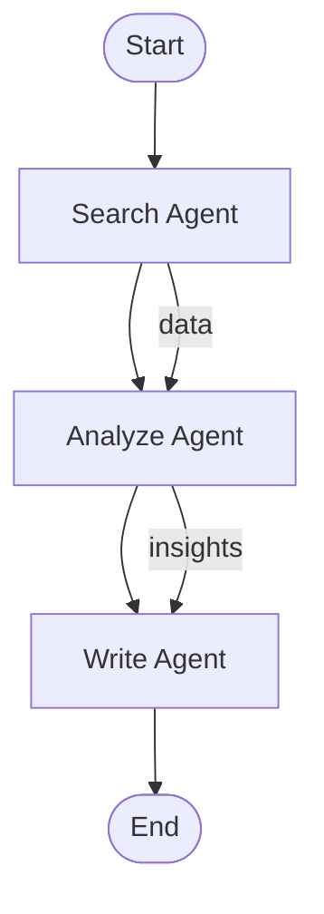

# Agent Factory Platform - Complete Architecture & Design

> **Mission**: Transform this Jupyter-notebook-based repo into a cohesive, production-minded Agent Factory Platform with a single, consistent architecture.

---

## A. REPO & PRODUCT SNAPSHOT

### Current State Analysis

**What the repo currently does:**
This repository contains a Jupyter notebook (`Agentic_Notebook.ipynb`) with examples demonstrating OpenAI Agents SDK, CrewAI, MCP servers, and various agent patterns. There's also a partially implemented `agent_factory` Python package with core primitives (Agent, Tool, Workflow), CLI commands, FastAPI endpoints, and some blueprint definitions. The examples directory contains Python scripts refactored from notebook cells.

**Why it's not yet a true Agent Factory product:**
1. **Fragmented architecture**: Notebook examples exist separately from the package, with no automated conversion path
2. **Missing integration**: Features like notebook conversion, knowledge packs, evaluation, visualization, and UI generation are not implemented
3. **No unified runtime**: Each feature operates independently without shared execution engine, logging, or observability
4. **Limited extensibility**: Blueprints exist but lack a cohesive packaging system that integrates with all platform features
5. **No production tooling**: Missing stress testing, benchmarking, autotune, prompt replay, and debugging capabilities

**Current technical constraints:**
- **Stack**: Python 3.8+, OpenAI SDK, Anthropic, FastAPI, Typer CLI, SQLAlchemy, Redis
- **Packaging**: Setuptools via `pyproject.toml`, GPL-3.0 license
- **Environment**: Docker support exists but not fully integrated with all features
- **Dependencies**: Mix of production libraries (FastAPI, SQLAlchemy) and notebook-focused tools

### Product Reframe

**This is an Agent Factory Platform that lets developers and teams convert Jupyter notebooks into production-ready AI agents, compose tools and workflows, run evaluations, and spin off full SaaS apps from validated agents.**

The platform provides:
- **Notebook → Agent conversion**: Automatically extract agents, tools, and workflows from Jupyter notebooks
- **Blueprint system**: Package agents with dependencies, configs, and metadata for reuse
- **Knowledge Packs**: Pluggable RAG modules that enhance agents with domain-specific knowledge
- **Evaluation & AutoTune**: Benchmark agents, stress test, and automatically optimize configurations
- **Workflow visualization**: Generate Mermaid/Graphviz diagrams from workflow definitions
- **Prompt replay & debugging**: Log all runs, replay with different configs, diff outputs
- **Multi-agent orchestration**: Coordinate multiple agents with routing and handoffs
- **Zero-config UI**: Generate web UIs for any agent based on its schema
- **SaaS scaffolding**: One-command generation of full SaaS apps from blueprints

### Ideal Customer Profiles (ICPs)

#### 1. **AI/ML Engineers** (Primary)
- **Who**: Developers building AI agents for production
- **Job**: Convert research notebooks into deployable agents quickly
- **Success**: Reduce time from notebook to production from weeks to hours; ship 5-10x more agents

#### 2. **Product Teams** (Primary)
- **Who**: Product managers and engineers building AI-powered features
- **Job**: Compose agents from blueprints, customize for their use case, deploy as SaaS
- **Success**: Launch MVP SaaS apps in days instead of months; monetize agents via marketplace

#### 3. **Education Institutions** (Strategic)
- **Who**: Universities, colleges, lifelong learning orgs (McGraw Hill partnership)
- **Job**: Deploy teaching assistants, learning path generators, research assistants
- **Success**: Improve student outcomes; reduce support costs; generate new revenue streams

#### 4. **Enterprise AI Teams** (Secondary)
- **Who**: Internal AI teams at large companies
- **Job**: Build internal agents, share via private marketplace, ensure compliance
- **Success**: Standardize agent development; reduce duplication; improve governance

#### 5. **Indie Developers** (Secondary)
- **Who**: Solo developers building AI products
- **Job**: Start with blueprints, customize, deploy quickly
- **Success**: Launch products faster; compete with larger teams

#### 6. **Agency/Consultants** (Secondary)
- **Who**: Agencies building custom AI solutions for clients
- **Job**: Reuse blueprints, customize per client, white-label SaaS apps
- **Success**: Deliver projects faster; increase margins; scale service offerings

---

## B. CORE ARCHITECTURE & PRIMITIVES

### Core Package Layout

```
agent_factory/
├── __init__.py                    # Package exports
│
├── agents/                        # Agent definitions, registry, runtime wrapper
│   ├── __init__.py
│   ├── agent.py                   # Core Agent class (refactor from core/agent.py)
│   ├── registry.py                # Agent registry (local + remote)
│   ├── runtime.py                 # Agent execution wrapper
│   └── config.py                  # Agent configuration schemas
│
├── tools/                         # Base tool interface, tool registry
│   ├── __init__.py
│   ├── base.py                    # Tool base class (refactor from core/tool.py)
│   ├── registry.py                # Tool registry
│   ├── decorator.py               # @function_tool decorator
│   └── schema.py                  # Tool schema generation
│
├── workflows/                      # Workflow model + execution
│   ├── __init__.py
│   ├── model.py                   # Workflow, WorkflowStep, Trigger (refactor from core/workflow.py)
│   ├── executor.py                # Workflow execution engine
│   ├── visualizer.py              # Mermaid/Graphviz generation
│   └── registry.py                # Workflow registry
│
├── orchestration/                 # Multi-agent routing/graphs
│   ├── __init__.py
│   ├── graph.py                   # AgentGraph model (nodes=agents, edges=routing)
│   ├── router.py                  # Message routing and handoff logic
│   └── executor.py                # Multi-agent execution engine
│
├── knowledge/                     # Knowledge Packs: loaders, retrievers, configs
│   ├── __init__.py
│   ├── model.py                   # KnowledgePack schema
│   ├── loader.py                  # Load knowledge packs from files/registry
│   ├── retriever.py               # RAG retriever interface + implementations
│   └── registry.py                # Knowledge pack registry
│
├── eval/                          # AutoTune, benchmarks, stress tests
│   ├── __init__.py
│   ├── model.py                   # Scenario, EvaluationResult, BenchmarkSuite
│   ├── runner.py                  # Benchmark/stress test execution engine
│   ├── autotune.py                # Auto-tuning loop (config optimization)
│   └── metrics.py                 # Metrics collection (latency, tokens, errors)
│
├── promptlog/                     # Prompt replay & diff
│   ├── __init__.py
│   ├── model.py                   # Run, PromptLogEntry data models
│   ├── storage.py                 # Storage backend (SQLite/JSONL)
│   ├── replay.py                  # Replay runs with different configs
│   └── diff.py                    # Compare runs (semantic + textual)
│
├── runtime/                       # Engine, memory, logging, config
│   ├── __init__.py
│   ├── engine.py                  # Unified execution engine (refactor from runtime/engine.py)
│   ├── memory.py                  # Memory store interface + implementations (refactor from core/memory.py)
│   ├── logging.py                 # Structured logging (integrate with promptlog)
│   └── config.py                  # Runtime configuration
│
├── ui/                            # Zero-config UI builder primitives
│   ├── __init__.py
│   ├── generator.py               # Generate HTML/React UI from agent schema
│   ├── templates/                 # UI templates
│   └── schema_inference.py        # Infer UI schema from agent/tool definitions
│
├── notebook_converter/            # Notebook → Agent conversion
│   ├── __init__.py
│   ├── converter.py               # Main conversion logic
│   ├── parser.py                  # Parse .ipynb files
│   ├── detector.py                # Detect agents, tools, workflows in notebooks
│   └── writer.py                  # Write agent/tool/workflow files
│
├── blueprints/                    # Blueprint packaging system
│   ├── __init__.py
│   ├── model.py                   # Blueprint schema (refactor from core/blueprint.py)
│   ├── loader.py                  # Load blueprints from YAML/JSON
│   ├── packager.py                # Package agents/tools/workflows into blueprints
│   └── registry.py                # Blueprint registry (local + remote)
│
├── cli/                           # Typer CLI entrypoints
│   ├── __init__.py
│   ├── main.py                    # Main CLI app (refactor existing)
│   ├── commands/
│   │   ├── agent.py               # agent create/list/run/delete
│   │   ├── tool.py                # tool register/list/test
│   │   ├── workflow.py            # workflow create/run/visualize
│   │   ├── blueprint.py           # blueprint install/list/publish
│   │   ├── notebook.py            # notebook convert
│   │   ├── eval.py                # benchmark/autotune commands
│   │   ├── promptlog.py           # list-runs/replay/diff-runs
│   │   ├── knowledge.py           # knowledge-pack attach/list
│   │   ├── orchestration.py       # orchestration graph commands
│   │   ├── ui.py                  # ui generate command
│   │   └── saas.py                # create-saas command
│   └── utils.py                   # CLI utilities
│
├── api/                           # FastAPI endpoints
│   ├── __init__.py
│   ├── main.py                    # FastAPI app (refactor existing)
│   ├── routes/
│   │   ├── agents.py              # Agent CRUD + run endpoints
│   │   ├── tools.py               # Tool endpoints
│   │   ├── workflows.py           # Workflow endpoints
│   │   ├── blueprints.py          # Blueprint endpoints
│   │   ├── executions.py          # Execution history endpoints
│   │   ├── eval.py                # Evaluation endpoints
│   │   ├── promptlog.py           # Prompt log endpoints
│   │   ├── knowledge.py           # Knowledge pack endpoints
│   │   ├── orchestration.py       # Multi-agent endpoints
│   │   └── ui.py                  # UI generation endpoints
│   └── middleware.py              # Auth, logging, error handling
│
├── integrations/                  # Pre-built integrations
│   ├── __init__.py
│   ├── openai_client.py           # OpenAI SDK wrapper (refactor existing)
│   ├── anthropic_client.py        # Anthropic wrapper (refactor existing)
│   └── tools/                     # Pre-built tools (refactor existing)
│       ├── calculator.py
│       ├── web_search.py
│       └── file_io.py
│
└── utils/                         # Shared utilities
    ├── __init__.py
    ├── config.py                  # Configuration management
    └── exceptions.py              # Common exceptions (refactor from core/exceptions.py)
```

### Core Primitives & Responsibilities

#### 1. **Agent** (`agents/agent.py`)
- **Responsibilities**: 
  - Define agent behavior (instructions, model, tools)
  - Execute agent runs via runtime engine
  - Manage agent lifecycle (create, update, delete)
  - Support handoffs to other agents
- **Key Classes**:
  - `Agent`: Core agent class with id, name, instructions, tools, model config
  - `AgentConfig`: Configuration (temperature, max_tokens, timeout, retries)
  - `AgentResult`: Execution result (output, status, tokens, execution_time, tool_calls)
  - `Handoff`: Represents delegation to another agent
- **Used by**: Workflows, Orchestration, Notebook Converter, Blueprints, Eval, UI Generator

#### 2. **Tool** (`tools/base.py`)
- **Responsibilities**:
  - Define callable functions agents can use
  - Generate JSON schemas from Python function signatures
  - Validate tool parameters and outputs
  - Register tools for discovery
- **Key Classes**:
  - `Tool`: Abstract base class for tools
  - `FunctionTool`: Tool wrapper for Python functions
  - `ToolMetadata`: Tool metadata (id, name, description, version, author, category)
  - `ParameterSchema`: Parameter schema definition
- **Used by**: Agents, Workflows, Notebook Converter, Blueprints, UI Generator

#### 3. **Workflow** (`workflows/model.py`)
- **Responsibilities**:
  - Define multi-step agent workflows
  - Support conditional branching
  - Map inputs/outputs between steps
  - Support triggers (webhook, schedule, event)
- **Key Classes**:
  - `Workflow`: Workflow definition with steps
  - `WorkflowStep`: Single step (agent_id, input_mapping, output_mapping, condition)
  - `Trigger`: Trigger definition (type, config)
  - `WorkflowResult`: Execution result
- **Used by**: Orchestration, Notebook Converter, Blueprints, Visualizer, Eval

#### 4. **Blueprint** (`blueprints/model.py`)
- **Responsibilities**:
  - Package agents, tools, workflows into reusable bundles
  - Define dependencies and configuration
  - Support marketplace publishing
  - Include monetization metadata
- **Key Classes**:
  - `Blueprint`: Blueprint definition (name, version, agents, tools, workflows, knowledge_packs)
  - `BlueprintMetadata`: Metadata (author, category, tags, pricing)
  - `BlueprintConfig`: Configuration (dependencies, env vars, required tools/agents)
- **Used by**: Marketplace, SaaS Scaffold, Notebook Converter

#### 5. **Knowledge Pack** (`knowledge/model.py`)
- **Responsibilities**:
  - Package domain-specific knowledge (RAG modules)
  - Define data sources, embedding models, retrievers
  - Attach knowledge to agents/workflows
- **Key Classes**:
  - `KnowledgePack`: Pack definition (id, name, domain, data_sources, embedding_config, retriever_config)
  - `KnowledgeRetriever`: Abstract retriever interface
  - `VectorStoreRetriever`: Vector store implementation
- **Used by**: Agents, Workflows, Blueprints

#### 6. **Evaluation / Run / Log** (`eval/model.py`, `promptlog/model.py`)
- **Responsibilities**:
  - Define evaluation scenarios and benchmarks
  - Log all agent/workflow runs
  - Support replay and diff
- **Key Classes**:
  - `Scenario`: Evaluation scenario (inputs, expected_outputs, metrics)
  - `EvaluationResult`: Result of evaluation (accuracy, latency, tokens, cost)
  - `BenchmarkSuite`: Collection of scenarios
  - `Run`: Single execution record (run_id, agent_name, inputs, outputs, timestamps)
  - `PromptLogEntry`: Detailed prompt/response log entry
- **Used by**: AutoTune, Stress Testing, Debugging, Analytics

### Features That Fit vs. Deferred

#### ✅ **FITS CLEANLY** (All features integrate with core primitives):
1. **Notebook → Agent Converter**: Extracts Agent/Tool/Workflow definitions → uses core primitives
2. **Blueprints**: Packages Agent/Tool/Workflow → uses core primitives
3. **Knowledge Packs**: Attaches to Agent/Workflow → uses core primitives
4. **Workflow Visualization**: Reads Workflow model → generates diagrams
5. **Prompt Replay**: Uses Run/PromptLogEntry → replays via Agent runtime
6. **Eval/AutoTune**: Uses Agent/Workflow → runs benchmarks → optimizes configs
7. **Multi-Agent Orchestration**: Uses Agent + Workflow → adds routing layer
8. **UI Generator**: Reads Agent/Tool schemas → generates UI
9. **SaaS Scaffold**: Uses Blueprint → generates FastAPI + UI

#### ⏸️ **DEFERRED** (Cannot be cleanly integrated yet):
1. **Real-time collaboration**: Requires WebSocket infrastructure, shared state management
2. **Advanced MCP server integration**: Requires deeper MCP protocol support
3. **Custom LLM providers**: Can be added later via integration layer
4. **Distributed execution**: Requires task queue (Celery/RQ) integration
5. **Advanced guardrails**: Can be added as Tool wrappers later

---

## C. NOTEBOOK → AGENT CONVERTER

### Design Overview

The notebook converter analyzes Jupyter notebooks and extracts:
- **Agents**: From cells that create `Agent` instances or use agent factory patterns
- **Tools**: From cells that define functions with `@function_tool` or similar decorators
- **Workflows**: From cells that orchestrate multiple agents or define sequential steps

### Notebook Introspection

**Conventions for reliable conversion:**
1. **Agent detection**: Look for patterns:
   - `Agent(...)` instantiation
   - `AgentFactory.create_*()` calls
   - Variables named `*_agent` that are Agent instances
2. **Tool detection**: Look for:
   - Functions decorated with `@function_tool`
   - Functions with clear docstrings describing tool behavior
   - Variables named `*_tool` that are Tool instances
3. **Workflow detection**: Look for:
   - Sequential agent calls with dependencies
   - `Workflow(...)` instantiation
   - `Crew(...)` or multi-agent patterns

**Parser implementation** (`notebook_converter/parser.py`):
- Parse `.ipynb` JSON structure
- Extract code cells
- Parse Python AST to detect patterns
- Extract metadata (cell outputs, markdown descriptions)

### Conversion Pipeline

**Input**: `path/to/notebook.ipynb`

**Output**:
1. `agent_factory/agents/<name>_config.yaml` - Agent configuration
2. `agent_factory/tools/<tool_name>.py` - Tool implementations
3. `agent_factory/workflows/<name>_workflow.yaml` - Workflow definition
4. Optional: `blueprints/<name>/blueprint.yaml` - Blueprint packaging

**Schemas**:

**Agent Config YAML**:
```yaml
agent:
  id: research-assistant
  name: Research Assistant
  instructions: "You are a research assistant..."
  model: gpt-4o
  config:
    temperature: 0.3
    max_tokens: 2000
  tools:
    - web_search
    - read_file
  metadata:
    source_notebook: notebook.ipynb
    source_cell: 4
```

**Tool Python**:
```python
"""Tool: web_search - Extracted from notebook.ipynb cell 2"""

from agent_factory.tools import function_tool

@function_tool
def web_search(query: str, max_results: int = 5) -> list:
    """Search the web for information."""
    # Implementation extracted from notebook
    ...
```

**Workflow YAML**:
```yaml
workflow:
  id: research-pipeline
  name: Research Pipeline
  steps:
    - id: search
      agent_id: research-searcher
      input_mapping:
        query: "$inputs.query"
    - id: analyze
      agent_id: research-analyzer
      input_mapping:
        data: "$steps.search.output"
  metadata:
    source_notebook: notebook.ipynb
```

### CLI Design

**Command**: `agent-factory notebook convert <notebook_path> [OPTIONS]`

**Options**:
- `--agent-name <name>`: Name for extracted agent
- `--output-dir <dir>`: Output directory (default: `./agent_factory/`)
- `--create-blueprint`: Also create blueprint.yaml
- `--interactive`: Prompt for confirmation on conflicts

**Behavior**:
1. Parse notebook
2. Detect agents/tools/workflows
3. Prompt user to confirm detections (if `--interactive`)
4. Write files to output directory
5. Handle conflicts: ask to overwrite or create new files with suffixes
6. Generate summary report

### Code Skeletons

See implementation files below.

---

## D. BLUEPRINTS & KNOWLEDGE PACKS

### Blueprint Schema

**File**: `agent_factory/blueprints/model.py`

```python
@dataclass
class Blueprint:
    id: str
    name: str
    version: str
    description: str
    author: str
    category: str
    tags: List[str]
    
    # Components
    agents: List[str]  # Agent IDs or paths
    tools: List[str]   # Tool IDs or paths
    workflows: List[str]  # Workflow IDs or paths
    knowledge_packs: List[str]  # Knowledge pack IDs
    
    # Configuration
    config: BlueprintConfig
    
    # Metadata
    metadata: BlueprintMetadata
```

**YAML Schema** (`blueprints/<name>/blueprint.yaml`):
```yaml
blueprint:
  id: research-assistant
  name: Research Assistant
  version: 1.0.0
  description: AI-powered research assistant
  author: Agent Factory Team
  category: research
  tags: [research, analysis, reports]
  
  agents:
    - research-searcher
    - research-analyzer
  
  tools:
    - web_search
    - read_file
    - write_file
  
  workflows:
    - research-pipeline
  
  knowledge_packs:
    - academic-research
  
  config:
    dependencies:
      - openai>=1.0.0
      - anthropic>=0.20.0
    environment_variables:
      OPENAI_API_KEY: "Required"
      SERPER_API_KEY: "Optional"
    required_tools:
      - web_search
    required_agents:
      - research-searcher
  
  metadata:
    demo_url: https://demo.agentfactory.io/research-assistant
    documentation: https://docs.agentfactory.io/blueprints/research-assistant
    pricing:
      model: free  # or "subscription", "one-time", "usage-based"
      tier: basic
```

### Knowledge Pack Schema

**File**: `agent_factory/knowledge/model.py`

```python
@dataclass
class KnowledgePack:
    id: str
    name: str
    version: str
    description: str
    domain: str  # e.g., "finance", "legal", "academic"
    tags: List[str]
    
    # Data sources
    data_sources: List[DataSource]
    
    # Embedding config
    embedding_config: EmbeddingConfig
    
    # Retriever config
    retriever_config: RetrieverConfig
```

**YAML Schema** (`knowledge_packs/<name>/pack.yaml`):
```yaml
knowledge_pack:
  id: academic-research
  name: Academic Research Pack
  version: 1.0.0
  description: Knowledge base for academic research
  domain: academic
  tags: [research, academic, papers]
  
  data_sources:
    - type: directory
      path: ./data/academic_papers
    - type: url
      url: https://arxiv.org/list/cs.AI/recent
      format: rss
  
  embedding_config:
    model: text-embedding-3-small
    provider: openai
    chunk_size: 1000
    chunk_overlap: 200
  
  retriever_config:
    type: vector_store
    vector_store: chroma
    top_k: 5
    similarity_threshold: 0.7
```

### CLI Commands

- `agent-factory blueprint list` - List installed blueprints
- `agent-factory blueprint install <name>` - Install blueprint from registry
- `agent-factory blueprint create <name>` - Create blueprint from current agents/tools
- `agent-factory blueprint publish <name>` - Publish to marketplace

- `agent-factory knowledge-pack list` - List installed knowledge packs
- `agent-factory knowledge-pack attach <agent_id> <pack_id>` - Attach pack to agent
- `agent-factory knowledge-pack create <name>` - Create new knowledge pack

### Example Blueprint

See `blueprints/research_assistant/blueprint.yaml` (already exists, will enhance).

### Example Knowledge Pack

See implementation files below.

---

## E. WORKFLOW VISUALIZER

### Design

**File**: `agent_factory/workflows/visualizer.py`

**Responsibilities**:
- Read workflow definitions (YAML/JSON or Workflow objects)
- Generate Mermaid syntax for markdown docs
- Generate Graphviz DOT for PNG/SVG export
- Support different visualization styles (flowchart, graph, sequence)

**Key Functions**:
- `to_mermaid(workflow: Workflow) -> str`: Generate Mermaid syntax
- `to_graphviz(workflow: Workflow) -> str`: Generate Graphviz DOT
- `visualize(workflow: Workflow, format: str, output_path: str)`: Generate and save

**Mermaid Output Example**:


### CLI Command

- `agent-factory workflow visualize <workflow_id> --format mermaid --output workflow.md`
- `agent-factory workflow visualize <workflow_id> --format graphviz --output workflow.png`

### Integration

Uses the same `Workflow` model from `workflows/model.py` - no parallel structures.

---

## F. PROMPT LOG, REPLAY & DIFF

### Data Model

**File**: `agent_factory/promptlog/model.py`

```python
@dataclass
class Run:
    run_id: str
    agent_id: Optional[str]
    workflow_id: Optional[str]
    step_id: Optional[str]
    inputs: Dict[str, Any]
    outputs: Dict[str, Any]
    status: str  # "success", "error", "timeout"
    execution_time: float
    tokens_used: int
    cost_estimate: float
    timestamp: datetime
    metadata: Dict[str, Any]

@dataclass
class PromptLogEntry:
    run_id: str
    step: int
    prompt: str
    response: str
    tool_calls: List[Dict[str, Any]]
    timestamp: datetime
```

### Storage Backend

**File**: `agent_factory/promptlog/storage.py`

**Implementations**:
- `SQLiteStorage`: SQLite database (default, simple)
- `JSONLStorage`: JSONL file (for development)
- `PostgreSQLStorage`: PostgreSQL (for production, via existing database/)

**Interface**:
```python
class PromptLogStorage(ABC):
    @abstractmethod
    def save_run(self, run: Run) -> None: ...
    
    @abstractmethod
    def get_run(self, run_id: str) -> Run: ...
    
    @abstractmethod
    def list_runs(self, filters: Dict[str, Any]) -> List[Run]: ...
    
    @abstractmethod
    def save_prompt_entry(self, entry: PromptLogEntry) -> None: ...
```

### Replay & Diff

**File**: `agent_factory/promptlog/replay.py`

- `replay_run(run_id: str, agent_config_override: Optional[Dict] = None) -> Run`: Replay a run with optional config changes

**File**: `agent_factory/promptlog/diff.py`

- `diff_runs(run_id_1: str, run_id_2: str) -> Dict[str, Any]`: Compare two runs (textual diff + semantic similarity)

### CLI Commands

- `agent-factory promptlog list-runs [--agent <agent_id>] [--limit 10]`
- `agent-factory promptlog replay <run_id> [--config-override <file>]`
- `agent-factory promptlog diff <run_id_1> <run_id_2>`

### Integration

Wired through `runtime/engine.py` - all agent/workflow executions automatically log to promptlog.

---

## G. EVAL, STRESS TESTING & AUTOTUNE

### Evaluation Primitives

**File**: `agent_factory/eval/model.py`

```python
@dataclass
class Scenario:
    id: str
    name: str
    inputs: Dict[str, Any]
    expected_outputs: Optional[Dict[str, Any]] = None
    expected_behavior: Optional[str] = None  # Natural language description

@dataclass
class EvaluationResult:
    scenario_id: str
    agent_id: str
    success: bool
    accuracy: Optional[float] = None  # If expected_outputs provided
    latency: float
    tokens_used: int
    cost_estimate: float
    error: Optional[str] = None
    output: Dict[str, Any]

@dataclass
class BenchmarkSuite:
    id: str
    name: str
    scenarios: List[Scenario]
    metrics: List[str]  # ["accuracy", "latency", "cost", "error_rate"]
```

### Stress Test & Benchmark Engine

**File**: `agent_factory/eval/runner.py`

- `run_benchmark(agent_id: str, suite: BenchmarkSuite) -> List[EvaluationResult]`: Execute all scenarios
- `stress_test(agent_id: str, concurrent_requests: int, duration: int) -> Dict[str, Any]`: Load testing

### AutoTune

**File**: `agent_factory/eval/autotune.py`

- `autotune(agent_id: str, suite: BenchmarkSuite, config_space: Dict[str, List]) -> AgentConfig`: Optimize agent config
  - Tries different temperature, max_tokens, model variants
  - Scores by accuracy proxy, cost, latency
  - Outputs tuned config to `agents/<name>_tuned.yaml`

### CLI Commands

- `agent-factory eval benchmark <agent_id> --suite <suite_id>`
- `agent-factory eval stress-test <agent_id> --concurrent 10 --duration 60`
- `agent-factory eval autotune <agent_id> --suite baseline --output tuned_config.yaml`

---

## H. MULTI-AGENT ORCHESTRATION & ZERO-CONFIG UI

### Multi-Agent Orchestration

**File**: `agent_factory/orchestration/graph.py`

```python
@dataclass
class AgentNode:
    agent_id: str
    agent: Agent

@dataclass
class RoutingEdge:
    from_agent: str
    to_agent: str
    condition: Optional[str] = None  # Expression for routing

@dataclass
class AgentGraph:
    nodes: List[AgentNode]
    edges: List[RoutingEdge]
    entry_point: str  # Starting agent
```

**File**: `agent_factory/orchestration/router.py`

- `route(message: Dict[str, Any], current_agent: str, graph: AgentGraph) -> str`: Determine next agent
- `execute_graph(graph: AgentGraph, inputs: Dict[str, Any]) -> Dict[str, Any]`: Execute multi-agent flow

**Integration**: Uses Agent + Workflow primitives, logs via PromptLog, evaluable via Eval.

### Zero-Config UI Generator

**File**: `agent_factory/ui/generator.py`

- `generate_ui(agent_id: str, output_dir: str, template: str = "react") -> None`: Generate UI
- Infers schema from Agent tools and input/output types
- Generates HTML or React components

**File**: `agent_factory/ui/schema_inference.py`

- `infer_ui_schema(agent: Agent) -> UISchema`: Extract input/output schemas

**Templates**: `agent_factory/ui/templates/`
- `simple.html`: Basic HTML form
- `react/`: React components (optional)

### CLI Commands

- `agent-factory ui generate <agent_id> --output ui/<name>/ --template react`
- `agent-factory orchestration create-graph <name> --agents agent1,agent2 --edges edge1.yaml`

---

## I. AGENT SAAS STARTER TEMPLATE

### Project Template Structure

```
apps/<name>/
├── backend/
│   ├── main.py                 # FastAPI app (reuses agent_factory.api)
│   ├── routes/
│   │   └── agent.py            # Agent endpoints
│   ├── auth.py                 # Simple token auth stub
│   ├── billing.py              # Stripe stub
│   └── Dockerfile
├── frontend/
│   ├── index.html              # Generated UI (reuses agent_factory.ui)
│   ├── app.js                 # Simple JS or React
│   └── Dockerfile
├── docker-compose.yml
├── README.md
└── .env.example
```

### Generator

**File**: `agent_factory/cli/commands/saas.py`

- `create_saas(blueprint_id: str, output_dir: str) -> None`: Scaffold SaaS app

**Templates**: `agent_factory/templates/saas/`
- Backend FastAPI template
- Frontend HTML/React template
- Docker configs
- Auth stub
- Billing stub (Stripe)

### CLI Command

- `agent-factory saas create <blueprint_id> --output ./apps/<name>/`

### Integration

Reuses:
- `agent_factory.api` for backend
- `agent_factory.ui` for frontend generation
- `agent_factory.blueprints` for blueprint loading
- `agent_factory.runtime` for execution

---

## J. NOTEBOOK REFACTORING & DOCS

### Notebook Refactor Plan

**For each notebook cell pattern**:
1. Extract logic to `agent_factory` package
2. Create example script in `examples/` that imports from `agent_factory`
3. Optionally keep cleaned notebook that imports instead of defining logic

**Example**: `Agentic_Notebook.ipynb` Cell 4 (Agent Factory)
- Extract to `agent_factory/integrations/openai_client.py`
- Create `examples/basic_agent.py` (already exists, enhance)
- Update notebook to import from `agent_factory`

### Docs Structure

**File**: `docs/OVERVIEW.md`
- Platform overview
- Core concepts (Agent, Tool, Workflow, Blueprint)
- Architecture diagram

**File**: `docs/GETTING_STARTED.md`
- From notebook to agent to blueprint flow
- Step-by-step tutorial

**File**: `docs/FEATURES.md`
- Notebook converter
- Blueprints
- Knowledge packs
- Eval/AutoTune
- UI generator
- SaaS scaffolding

**File**: `docs/QUICK_START.md` (enhance existing)
- Step 1: Run notebook or script
- Step 2: Convert to agent
- Step 3: Attach knowledge pack
- Step 4: Run benchmarks
- Step 5: Generate UI / SaaS scaffold

---

## K. PHASED ROADMAP & PR PLAN

### Phase 1: Core Primitives + Notebook Converter (Week 1-2)

**Goals**:
- Refactor existing Agent/Tool/Workflow into unified structure
- Implement notebook converter
- Create conversion CLI

**Main Modules**:
- `agent_factory/agents/` (refactor)
- `agent_factory/tools/` (refactor)
- `agent_factory/workflows/` (refactor)
- `agent_factory/notebook_converter/` (new)
- `agent_factory/runtime/` (refactor)

**Validation**:
- Convert `Agentic_Notebook.ipynb` to agents/tools/workflows
- Run converted agents successfully

### Phase 2: Blueprints, Knowledge Packs, PromptLog, Eval (Week 3-4)

**Goals**:
- Implement blueprint packaging system
- Implement knowledge packs
- Implement prompt logging
- Implement evaluation framework

**Main Modules**:
- `agent_factory/blueprints/` (enhance)
- `agent_factory/knowledge/` (new)
- `agent_factory/promptlog/` (new)
- `agent_factory/eval/` (new)

**Validation**:
- Package research assistant as blueprint
- Attach knowledge pack to agent
- Log runs and replay them
- Run benchmark suite

### Phase 3: Orchestration, UI Generator (Week 5-6)

**Goals**:
- Implement multi-agent orchestration
- Implement UI generator

**Main Modules**:
- `agent_factory/orchestration/` (new)
- `agent_factory/ui/` (new)
- `agent_factory/workflows/visualizer.py` (new)

**Validation**:
- Create multi-agent graph and execute
- Generate UI for agent and test it
- Visualize workflow as Mermaid diagram

### Phase 4: SaaS Scaffold, Docs, Polish (Week 7-8)

**Goals**:
- Implement SaaS scaffold generator
- Complete documentation
- Refactor notebooks to examples
- Integration testing

**Main Modules**:
- `agent_factory/cli/commands/saas.py` (new)
- `agent_factory/templates/saas/` (new)
- `docs/` (enhance)
- `examples/` (refactor)

**Validation**:
- Generate SaaS app from blueprint
- Run end-to-end flow: notebook → agent → blueprint → SaaS
- All tests pass

### PR Breakdown

#### PR 1: Core Architecture Refactor (Phase 1)
- **Title**: "Refactor core primitives into unified architecture"
- **Scope**: Move Agent/Tool/Workflow to new package structure, unify interfaces
- **Files**: `agent_factory/agents/`, `agent_factory/tools/`, `agent_factory/workflows/`, `agent_factory/runtime/`
- **Risk**: Medium (touches core code, needs careful migration)

#### PR 2: Notebook Converter (Phase 1)
- **Title**: "Implement notebook → agent converter"
- **Scope**: Parse notebooks, detect agents/tools/workflows, generate files
- **Files**: `agent_factory/notebook_converter/`, CLI command
- **Risk**: Low (new feature, isolated)

#### PR 3: Blueprints & Knowledge Packs (Phase 2)
- **Title**: "Implement blueprint and knowledge pack systems"
- **Scope**: Blueprint packaging, knowledge pack loading/attachment
- **Files**: `agent_factory/blueprints/`, `agent_factory/knowledge/`
- **Risk**: Medium (integrates with agents/tools)

#### PR 4: Prompt Logging & Replay (Phase 2)
- **Title**: "Implement prompt logging, replay, and diff"
- **Scope**: Log all runs, replay functionality, diff comparison
- **Files**: `agent_factory/promptlog/`, integrate with runtime
- **Risk**: Medium (requires runtime integration)

#### PR 5: Evaluation & AutoTune (Phase 2)
- **Title**: "Implement evaluation framework and autotune"
- **Scope**: Benchmark suites, stress testing, config optimization
- **Files**: `agent_factory/eval/`
- **Risk**: Low (isolated feature)

#### PR 6: Workflow Visualizer (Phase 3)
- **Title**: "Add workflow visualization (Mermaid/Graphviz)"
- **Scope**: Generate diagrams from workflow definitions
- **Files**: `agent_factory/workflows/visualizer.py`
- **Risk**: Low (read-only feature)

#### PR 7: Multi-Agent Orchestration (Phase 3)
- **Title**: "Implement multi-agent orchestration engine"
- **Scope**: Agent graphs, routing, handoffs
- **Files**: `agent_factory/orchestration/`
- **Risk**: Medium (complex feature)

#### PR 8: UI Generator & SaaS Scaffold (Phase 4)
- **Title**: "Add UI generator and SaaS scaffold"
- **Scope**: Generate UIs from agent schemas, scaffold SaaS apps
- **Files**: `agent_factory/ui/`, `agent_factory/cli/commands/saas.py`, `agent_factory/templates/`
- **Risk**: Low (new features)

#### PR 9: Docs & Examples Refactor (Phase 4)
- **Title**: "Complete documentation and refactor notebooks"
- **Scope**: Write docs, convert notebooks to examples
- **Files**: `docs/`, `examples/`, update notebooks
- **Risk**: Low (documentation)

---

## Implementation Notes

1. **Backward Compatibility**: Maintain compatibility with existing `agent_factory` API during refactor
2. **Testing**: Each PR should include tests for new features
3. **Migration Path**: Provide migration scripts for existing users
4. **Documentation**: Update docs with each PR
5. **Incremental**: Each phase builds on previous phases

---

**Status**: ✅ Design complete. Ready for implementation.
